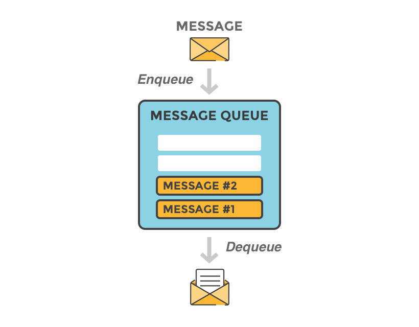
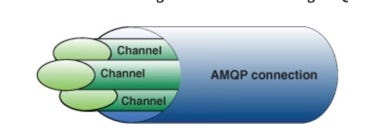
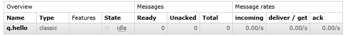
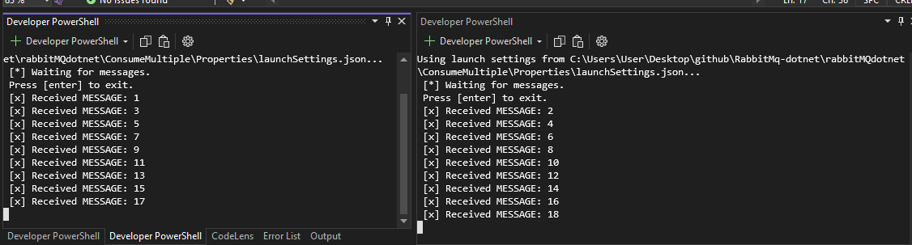
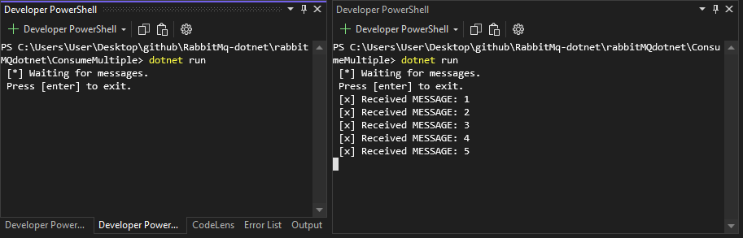
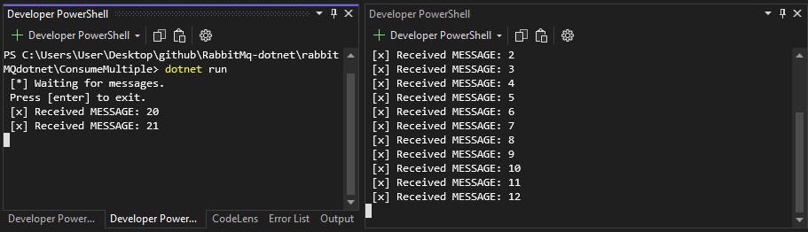

# Overview



# Types of exchanges

- Direct: The message is routed to the queues whose binding key exactly matches the routing key of the message. For example, if the queue is bound to the exchange with the binding key pdfprocess, a message published to the exchange with a routing key pdfprocess is routed to that queue.
- Fanout: A fanout exchange routes messages to all of the queues bound to it.
- Topic: The topic exchange does a wildcard match between the routing key and the routing pattern specified in the binding.
- Headers: Headers exchanges use the message header attributes for routing.


## Message acknowledgements

- It's up to the consumer to acknowledge a message. Once the message has been acknowledged, message is removed from the queue. 
- The consuming application should not acknowledge a message until it is completely finished with it. 
- Consumer can also Nack (negative acknowledge). So, message, by default, is sent back to the queue for another try

# Run RabbitMQ

First, 'docker-compose up' to run the rabbitmq

http://localhost:15672/
guest
guest

# Publish first "Hello word"

## Connection and channels

An AMQP **connection** is a link between the client and the broker that
performs underlying networking tasks, including initial authentication, IP resolution, and
networking

Each AMQP **connection** maintains a set of underlying channels. A channel reuses a
connection, forgoing the need to reauthorize and open a new TCP stream, making it more
resource-efficient.



```cs
var factory = new ConnectionFactory { HostName = "localhost" };
using var connection = await factory.CreateConnectionAsync();
using var channel = await connection.CreateChannelAsync();
```

## Create a Queue via code (a queue can also be created via RabbitMQ Management -> http://localhost:15672/#/)

Declaring a queue is idempotent - it will only be created if it doesn't exist already.

```cs
await channel.QueueDeclareAsync(queue: "q.hello", durable: false, exclusive: false, autoDelete: false,
    arguments: null);
```

- queue -> The name of the queue
- durable-> Should this queue survive a broker restart
- exclusive -> Should this queue use be limited to its declaring connection? Such a queue will be deleted when its declaring connection closes
- autoDelete -> Should this queue be auto-deleted when its last consumer (if any) unsubscribes
- arguments -> Optional; additional queue arguments, e.g. "x-queue-type"




## Message as a byte array.

```cs
const string message = "Hello World!";
var body = Encoding.UTF8.GetBytes(message);
```

## Publish message.

**Default Exchange** is a direct exchange with no name (empty string) pre-declared by the broker. It has one special property that makes it very useful for simple applications: every queue that is created is automatically bound to it with a routing key which is the same as the queue name.


When the code finishes running, the channel and the connection will be disposed.

```cs
await channel.BasicPublishAsync(exchange: string.Empty, routingKey: "q.hello", body: body);
```

- exchange -> if it is empty, message goes to default-exchange
- routingKey -> for this case, default-exchange, routingKey must match queue name. otherwise, message will not be routed to a queue.
- body -> message


# Receive first "Hello word"

Create connection anc channel

Note that we declare the queue here as well. Because we might start the consumer before the publisher, we want to make sure the queue exists before we try to consume messages from it.

```cs
var factory = new ConnectionFactory { HostName = "localhost" };
using var connection = await factory.CreateConnectionAsync();
using var channel = await connection.CreateChannelAsync();

await channel.QueueDeclareAsync(queue: "q.hello", durable: false, exclusive: false, autoDelete: false,
    arguments: null);
```

Code to consume message


```cs
var consumer = new AsyncEventingBasicConsumer(channel);
consumer.ReceivedAsync += (model, ea) =>
{
    var body = ea.Body.ToArray();
    var message = Encoding.UTF8.GetString(body);
    Console.WriteLine($" [x] Received {message}");
    return Task.CompletedTask;
};

await channel.BasicConsumeAsync("hello", autoAck: true, consumer: consumer);
```

- queue -> same "q.hello"
- autoAck -> to acknowledge the message
- consumer -> code with channel and event callback

# Multiple Workers/Consumers

- Same producer but we are sending 100 messages
- Same consumer but we are delaying 1 second to reproduce a long task
- Run multiple PowerShell to run multiple consumers: "dotnet run" command in each powershell
  


## Consumer prefetch 

Note that when we start a second consumer, it doesn't pick any un-acked messages.



Limit un-acked messages per consumer so one worker doesn’t hog the entire queue

Prefetch is applied separately to each new consumer on the channel

- prefetchSize -> Size of the prefetch in bytes
- prefetchCount -> The prefetch count
- global -> If set to 'true', use global prefetch

```cs
await channel.BasicQosAsync(prefetchSize: 0, prefetchCount: 10, global: false);
```



## Message acknowledgment

Doing a task can take a few seconds. You may wonder what happens if one of the consumers starts a long task and dies with it only partly done. With our current code, once RabbitMQ delivers a message to the consumer it immediately marks it for deletion. In this case, if you terminate a worker we will lose the message it was just processing. We'll also lose all the messages that were dispatched to this particular worker but were not yet handled.

But we don't want to lose any tasks. If a worker dies, we'd like the task to be delivered to another worker.

- In consumer, set autoAck: false (If autoAck is true, a message is considered done as soon as it's delivered)

```cs
await channel.BasicConsumeAsync("q.hello", autoAck: false, consumer: consumer);
```

- add BasicAckAsync
- multiple -> Ack all messages up to the delivery tag if set to true.

```cs
Console.WriteLine($" [x] Received {message}");
await channel.BasicAckAsync(deliveryTag: ea.DeliveryTag, multiple: false);
```

## Message durability

We have learned how to make sure that even if the consumer dies, the task isn't lost. But our tasks will still be lost if RabbitMQ server stops. When RabbitMQ quits or crashes it will forget the queues and messages unless you tell it not to. Two things are required to make sure that messages aren't lost: we need to mark both the queue and messages as durable.


This QueueDeclareAsync (durable: true) change needs to be applied to both the producer and consumer code

Note: Declaring a queue is idempotent - it will not be created/modified if it already exists.

```cs
await channel.QueueDeclareAsync(queue: "q.hello", durable: true, exclusive: false, autoDelete: false, arguments: null);
```

```cs
var properties = new BasicProperties
{
    Persistent = true
};

await channel.BasicPublishAsync(exchange: string.Empty, routingKey: "q.hello", true, basicProperties: properties, body: body);
```

Note on Message Persistence: Marking messages as persistent doesn't fully guarantee that a message won't be lost. Although it tells RabbitMQ to save the message to disk, there is still a short time window when RabbitMQ has accepted a message and hasn't saved it yet. Also, RabbitMQ doesn't do fsync(2) for every message -- it may be just saved to cache and not really written to the disk. The persistence guarantees aren't strong, but it's more than enough for our simple task queue. If you need a stronger guarantee then you can use publisher confirms.

## TO DO: Publisher confirms

https://www.rabbitmq.com/docs/confirms

## References:

https://www.rabbitmq.com/tutorials/tutorial-one-dotnet

https://www.rabbitmq.com/tutorials/tutorial-two-dotnet

https://medium.com/@deshan.m/6-fantastic-mistakes-that-you-can-do-using-rabbitmq-nodejs-cbf5db99613c

https://medium.com/codait/handling-failure-successfully-in-rabbitmq-22ffa982b60f

https://www.cloudamqp.com/blog/part1-rabbitmq-best-practice.html

https://www.cloudamqp.com/blog/part4-rabbitmq-13-common-errors.html

https://www.cloudamqp.com/blog/part3-rabbitmq-best-practice-for-high-availability.html

https://www.cloudamqp.com/blog/part2-rabbitmq-best-practice-for-high-performance.html