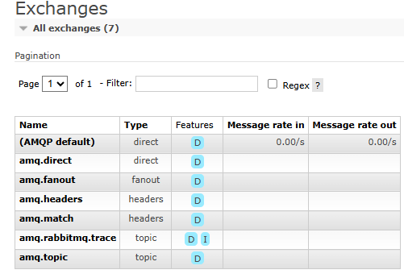
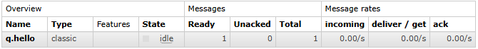

# Overview

- A producer is a user application that sends messages.
- A queue is a buffer that stores messages.
- A consumer is a user application that receives messages.

The core idea in the messaging model in RabbitMQ is that the producer never sends any messages directly to a queue.

Instead, the producer can only send messages to an exchange and the exchange then pushes them to queues. The exchange must know exactly what to do with a message it receives. Should it be appended to a particular queue? Should it be appended to many queues? Or should it get discarded? The rules for that are defined by the exchange type.


# Types of exchanges

- Direct: The message is routed to the queues whose binding key exactly matches the routing key of the message. For example, if the queue is bound to the exchange with the binding key pdfprocess, a message published to the exchange with a routing key pdfprocess is routed to that queue.
- Fanout: A fanout exchange routes messages to all of the queues bound to it.
- Topic: The topic exchange does a wildcard match between the routing key and the routing pattern specified in the binding.
- Headers: Headers exchanges use the message header attributes for routing.


## Message acknowledgements

- It's up to the consumer to acknowledge a message. Once the message has been acknowledged, message is removed from the queue. 
- The consuming application should not acknowledge a message until it is completely finished with it. 
- Consumer can also Nack (negative acknowledge). So, message, by default, is sent back to the queue for another try

# Run RabbitMQ

First, 'docker-compose up' to run the rabbitmq

http://localhost:15672/
guest
guest

# Publish first "Hello word"

## Connection and channels

An AMQP **connection** is a link between the client and the broker that
performs underlying networking tasks, including initial authentication, IP resolution, and
networking

Each AMQP **connection** maintains a set of underlying channels. A channel reuses a
connection, forgoing the need to reauthorize and open a new TCP stream, making it more
resource-efficient.


```cs
var factory = new ConnectionFactory { HostName = "localhost" };
using var connection = await factory.CreateConnectionAsync();
using var channel = await connection.CreateChannelAsync();
```

## Create a Queue via code (a queue can also be created via RabbitMQ Management -> http://localhost:15672/#/)

Declaring a queue is idempotent - it will only be created if it doesn't exist already.

```cs
await channel.QueueDeclareAsync(queue: "q.hello", durable: false, exclusive: false, autoDelete: false,
    arguments: null);
```

- queue -> The name of the queue
- durable-> Should this queue survive a broker restart
- exclusive -> Should this queue use be limited to its declaring connection? Such a queue will be deleted when its declaring connection closes
- autoDelete -> Should this queue be auto-deleted when its last consumer (if any) unsubscribes
- arguments -> Optional; additional queue arguments, e.g. "x-queue-type"


## Message as a byte array.

```cs
const string message = "Hello World!";
var body = Encoding.UTF8.GetBytes(message);
```

## Publish message.

**Default Exchange** is a direct exchange with no name (empty string) pre-declared by the broker. It has one special property that makes it very useful for simple applications: every queue that is created is automatically bound to it with a routing key which is the same as the queue name.



When the code finishes running, the channel and the connection will be disposed.

```cs
await channel.BasicPublishAsync(exchange: string.Empty, routingKey: "q.hello", body: body);
```

- exchange -> if it is empty, message goes to default-exchange
- routingKey -> for this case, default-exchange, routingKey must match queue name. otherwise, message will not be routed to a queue.
- body -> message



# Receive first "Hello word"

Create connection anc channel

Note that we declare the queue here as well. Because we might start the consumer before the publisher, we want to make sure the queue exists before we try to consume messages from it.

```cs
var factory = new ConnectionFactory { HostName = "localhost" };
using var connection = await factory.CreateConnectionAsync();
using var channel = await connection.CreateChannelAsync();

await channel.QueueDeclareAsync(queue: "q.hello", durable: false, exclusive: false, autoDelete: false,
    arguments: null);
```

Code to consume message

```cs
var consumer = new AsyncEventingBasicConsumer(channel);
consumer.ReceivedAsync += (model, ea) =>
{
    var body = ea.Body.ToArray();
    var message = Encoding.UTF8.GetString(body);
    Console.WriteLine($" [x] Received {message}");
    return Task.CompletedTask;
};

await channel.BasicConsumeAsync("hello", autoAck: true, consumer: consumer);
```

- queue -> same "q.hello"
- autoAck -> to acknowledge the message
- consumer -> code with channel and event callback

# Work queue

The assumption behind a Work Queue is that each task is delivered to exactly one worker.


- Same producer but we are sending 100 messages
- Same consumer but we are delaying 1 second to reproduce a long task
- Run multiple PowerShell to run multiple consumers: "dotnet run" command in each powershell
  


## Message acknowledgment

Doing a task can take a few seconds. You may wonder what happens if one of the consumers starts a long task and dies with it only partly done. With our current code, once RabbitMQ delivers a message to the consumer it immediately marks it for deletion. In this case, if you terminate a worker we will lose the message it was just processing. We'll also lose all the messages that were dispatched to this particular worker but were not yet handled.

But we don't want to lose any tasks. If a worker dies, we'd like the task to be delivered to another worker.

- In consumer, set autoAck: false (If autoAck is true, a message is considered done as soon as it's delivered)

```cs
await channel.BasicConsumeAsync("q.hello", autoAck: false, consumer: consumer);
```

- add BasicAckAsync
- multiple -> Ack all messages up to the delivery tag if set to true.

```cs
Console.WriteLine($" [x] Received {message}");
await channel.BasicAckAsync(deliveryTag: ea.DeliveryTag, multiple: false);
```

## Consumer prefetch 

Note that when we start a second consumer (on the left side of image), it doesn't pick any un-acked messages.


Limit un-acked messages per consumer so one worker doesn’t hog the entire queue

Prefetch is applied separately to each new consumer on the channel

- prefetchSize -> Size of the prefetch in bytes
- prefetchCount -> The prefetch count
- global -> If set to 'true', use global prefetch

```cs
await channel.BasicQosAsync(prefetchSize: 0, prefetchCount: 10, global: false);
```

- second worker starts at message 20 even though first worker is still processing message 12. this happens because each worker is prefetching in batch of 10.


- first worker (on the right side of image) goes from message 19 to 30.
- After both workers are active and all last time prefetch messages were processed (after message 30), the messages start to be consumed in round-robin fashion.


## Round robin

- Round robin scheduling algorithms distribute processes evenly among resources


## Message durability

We have learned how to make sure that even if the consumer dies, the task isn't lost. But our tasks will still be lost if RabbitMQ server stops. When RabbitMQ quits or crashes it will forget the queues and messages unless you tell it not to. Two things are required to make sure that messages aren't lost: we need to mark both the queue and messages as durable.

This QueueDeclareAsync (durable: true) change needs to be applied to both the producer and consumer code

Note: Declaring a queue is idempotent - it will not be created/modified if it already exists.

```cs
await channel.QueueDeclareAsync(queue: "q.hello", durable: true, exclusive: false, autoDelete: false, arguments: null);
```

```cs
var properties = new BasicProperties
{
    Persistent = true
};

await channel.BasicPublishAsync(exchange: string.Empty, routingKey: "q.hello", true, basicProperties: properties, body: body);
```

Note on Message Persistence: Marking messages as persistent doesn't fully guarantee that a message won't be lost. Although it tells RabbitMQ to save the message to disk, there is still a short time window when RabbitMQ has accepted a message and hasn't saved it yet. Also, RabbitMQ doesn't do fsync(2) for every message -- it may be just saved to cache and not really written to the disk. The persistence guarantees aren't strong, but it's more than enough for our simple task queue. If you need a stronger guarantee then you can use publisher confirms.

## Enabling Publisher Confirms on a Channel

- add channelOpts enabling publisher confirmation.

```cs
var channelOpts = new CreateChannelOptions(
    publisherConfirmationsEnabled: true,
    publisherConfirmationTrackingEnabled: true,
    outstandingPublisherConfirmationsRateLimiter: new ThrottlingRateLimiter(50)
);

using var channel = await connection.CreateChannelAsync(channelOpts);
```

- add delay to test stopping rabbitmq docker container
- Put code inside try catch block
- i-- to retry current message not sent.

Note: The await returns as soon as the message has been confirmed. If the message is is nack-ed or returned (meaning the broker could not take care of it for some reason), the method will throw an exception. 

```cs
for (int i = 0; i < 100; i++)
{
    await Task.Delay(100);
    var message = $"MESSAGE: {i + 1}";
    var body = Encoding.UTF8.GetBytes(message);

    try
    {
        await channel.BasicPublishAsync(exchange: string.Empty, routingKey: "q.hello", true, basicProperties: properties, body: body);
        Console.WriteLine($" [x] Sent {message}");
    }
    catch (Exception ex)
    {
        Console.WriteLine($" [] Failed to send {message}. Error {ex.Message}");
        i--;
    }
}
```


# Publish/Subscribe

The assumption behind a Publish/Subscribe is that each task is delivered to multiple consumers.


## Publish

Fanout just broadcasts all the messages it receives to all the queues it knows

- Create a exchange of type fanout

```cs
await channel.ExchangeDeclareAsync(exchange: "emailmessages", type: ExchangeType.Fanout);
```

- Publish to that exchange

```cs
await channel.BasicPublishAsync(exchange: "emailmessages", routingKey: string.Empty, body: body);
```

## Subscribe

For both subscribers (log/send e-mail):

- Bind exchange to a new temporary queue

```cs
await channel.QueueBindAsync(queue: queueDeclareResult.QueueName, exchange: "emailmessages", routingKey: string.Empty);
```

- Consume message from that temporary queue

```cs
await channel.BasicConsumeAsync(queueDeclareResult.QueueName, autoAck: true, consumer: consumer);
```


## Temporary queues

We want to hear about all log messages, not just a subset of them. We're also interested only in currently flowing messages not in the old ones. 

To solve that we need two things:

- Whenever we connect to Rabbit we need a fresh, empty queue. To do this we could create a queue with a random name, or, even better - let the server choose a random queue name for us.
- Once we disconnect the consumer, the queue should be automatically deleted.

Notes:
- In the .NET client, when we supply no parameters to QueueDeclareAsync() we create a non-durable, exclusive, autodelete queue with a generated name:
- Also, the messages will be lost if no queue is bound to the exchange yet, but that's okay for us; if no consumer is listening yet we can safely discard the message.


## Remove Temporary queue:

This tutorial follows rabbitmq documentation example. But, in real world, we don't wanna temporary queues to avoid losing messages.

Example: If subscriber(consumer) stop working even for few seconds or the RabbitMQ (broker) restart, the message/queue will be deleted.

- Instead, declare a queue in each subscriber application

```cs
var queueDeclareResult = await channel.QueueDeclareAsync(queue: "q.logs", durable: true, exclusive: false, autoDelete: false, arguments: null);
```

```cs
var queueDeclareResult = await channel.QueueDeclareAsync(queue: "q.sendemails", durable: true, exclusive: false, autoDelete: false, arguments: null);
```

# Routing with Direct exchange

Using a direct exchange, a message goes to the queues whose binding key exactly matches the routing key of the message.


In this example, a message published to the exchange with a routing key orange will be routed to queue Q1. Messages with a routing key of black or green will go to Q2. All other messages will be discarded.

# Topics with Topic exchange

Direct exchange has limitations. It can't do routing based on multiple criteria.


In this example, we're going to send messages which all describe animals. The messages will be sent with a routing key that consists of three words (two dots). The first word in the routing key will describe speed, second a colour and third a species: <speed>.<colour>.<species>

These bindings can be summarised as:

- Q1 is interested in all the orange animals.
- Q2 wants to hear everything about rabbits, and everything about lazy animals.

Notes:

- "*" (star) can substitute for exactly one word.
- "#" (hash) can substitute for zero or more words.

# Handling Failure Successfully

## Ack

By setting the auto-ack parameter on the consumer to false, we ensure that messages are removed from the queue only when a consumer has accepted the message and acknowledged that it was successfully processed

If a consumer takes a message and does not acknowledge that it has been successfully processed within a given time window, then another consumer is given the message. This can lead to messages being processed more than once so it's important to make sure that your system can tolerate this outcome, and that the timeout settings are set appropriately for the length of time the worker is expected to need to process the message. On the plus side, this does give us "at-least-once" delivery guarantee as we can be sure that the message will get processed.

## Dead letter 

Problems arise when “at-least-once” doesn’t have room for the fact that some messages will never be successfully processed. Perhaps they are invalid or intentionally harmful, or simply contain data that the worker doesn’t know how to handle. By always leaving them on the queue, the queue could become clogged up with these messages that can’t be processed but aren’t getting drained away. We can configure our queues to direct any rejected messages to a “dead letter” exchange; this allows us to inspect and potentially process later any messages which our existing workers didn’t handle.

We can simply give up on them without any further processing. To do so, we send a `reject` response rather than our usual `ack` with the requeue option set to false so that the message will never be processed

## Queue Is Too Full

## TTL (“time to live”)

## delayed retry / exponential backoff strategy

## Idempotency

Reprocessing messages requires idempotent tasks at the application side too

# Best Practices

https://medium.com/@deshan.m/6-fantastic-mistakes-that-you-can-do-using-rabbitmq-nodejs-cbf5db99613c

https://www.cloudamqp.com/blog/part1-rabbitmq-best-practice.html

https://www.cloudamqp.com/blog/part4-rabbitmq-13-common-errors.html

https://www.cloudamqp.com/blog/part3-rabbitmq-best-practice-for-high-availability.html

https://www.cloudamqp.com/blog/part2-rabbitmq-best-practice-for-high-performance.html

# TO DO: Real world example

Book


## References:

https://www.rabbitmq.com/tutorials/tutorial-one-dotnet

https://www.rabbitmq.com/tutorials/tutorial-two-dotnet

https://www.rabbitmq.com/tutorials/tutorial-three-dotnet

https://www.rabbitmq.com/tutorials/tutorial-four-dotnet

https://www.rabbitmq.com/tutorials/tutorial-five-dotnet

https://www.rabbitmq.com/tutorials/tutorial-seven-dotnet

https://www.rabbitmq.com/docs/confirms

https://medium.com/codait/handling-failure-successfully-in-rabbitmq-22ffa982b60f

[Book] RabbitMQ Essentials: Build distributed and scalable applications with message queuing using RabbitMQ 